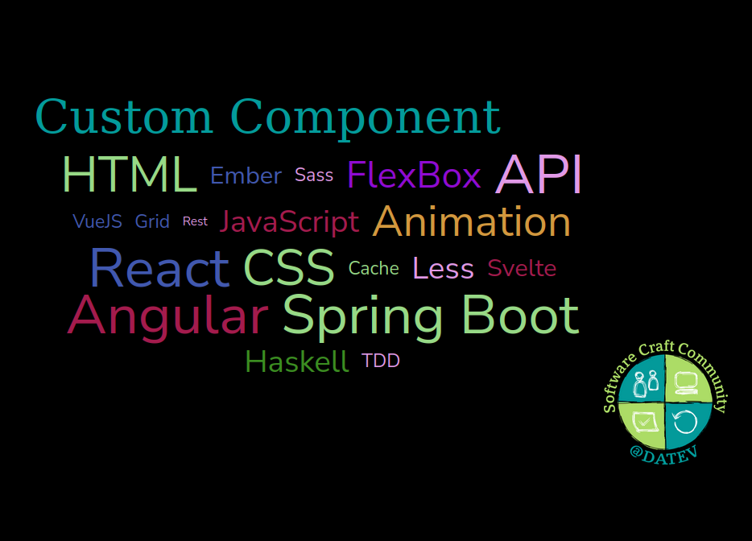

# slidev-theme-datev-scc

A theme in the style of DATEV Software Craft Community for [Slidev](https://github.com/slidevjs/slidev).

## Install

Add the following frontmatter to your `slides.md`. Start Slidev then it will prompt you to install the theme automatically.

<pre><code>---
theme: <b>datev-scc</b>
---</code></pre>

Learn more about [how to use a theme](https://sli.dev/themes/use).

## Layouts

This theme provides the following layouts:

- center
- cover
- default
- intro
- quote

All layouts above have been enriched with the SCC logo.

You can opt-out the logo on the default layout by specifying `disableLogo: true` in the frontmatter.

## Components

This theme provides the following components:

- WordCloud

## Contributing

- `npm install`
- `npm run dev` to start theme preview of `example.md`
- Edit the `example.md` and style to see the changes
- `npm run export` to generate the preview PDF
- `npm run screenshot` to generate the preview PNG
