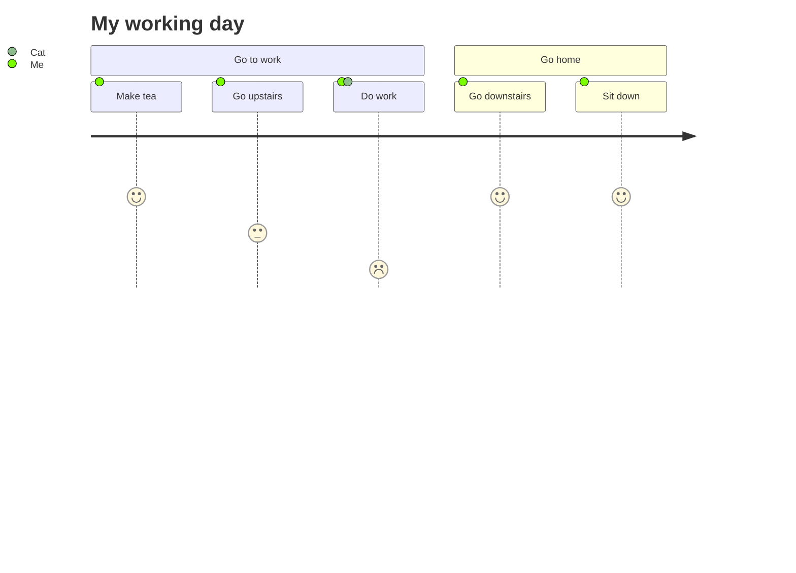

# Slidev Theme Starter

Example Presentation

<div class="pt-12">
  <span @click="next" class="px-2 p-1 rounded cursor-pointer hover:bg-white hover:bg-opacity-10">
    Press Space for next page <carbon-arrow-right class="inline"/>
  </span>
</div>

<!--
 This is just a note
-->

---

# What is Slidev?

Slidev is a slides maker and presenter designed for developers, consist of the following features

- 📝 **Text-based** - focus on the content with Markdown, and then style them later
- 🎨 **Themable** - theme can be shared and used with npm packages
- 🧑‍💻 **Developer Friendly** - code highlighting, live coding with autocompletion
- 🤹 **Interactive** - embedding Vue components to enhance your expressions
- 🎥 **Recording** - built-in recording and camera view
- 📤 **Portable** - export into PDF, PNGs, or even a hostable SPA
- 🛠 **Hackable** - anything possible on a webpage

<br>
<br>

Read more about [Why Slidev?](https://sli.dev/guide/why)

---

# Some Icons

<uim-rocket class="inline"/>
<twemoji-pile-of-poo />
<mdi-github />
<mdi-twitter />
<mdi-twitch />
<mdi-youtube />
<mdi-email />
<mdi-wifi />

See also [Slidev Icons](https://sli.dev/guide/syntax.html#icons)

---
layout: default 
disableLogo: true
---

# Disable Logo

---
layout: quote 
author: John Doe
link: https://www.google.de
---

# Quotes

This is my very long quote that needs more than one line to render

---

# Custom Component

<WordCloud :list="[
'HTML',  
'Ember',  
'Sass',  
'FlexBox',  
'API',  
'VueJS',  
'Grid',  
'Rest',  
'JavaScript',  
'Animation',  
'React',  
'CSS',  
'Cache',  
'Less',  
'Svelte',  
'Angular',
'Spring Boot',
'Haskell',
'TDD',
]"/>

---

# Navigation

Hover on the bottom-left corner to see the navigation's controls panel[^1]

<div v-click>

### Keyboard Shortcuts

|     |     |
| --- | --- |
| <kbd>space</kbd> / <kbd>tab</kbd> / <kbd>right</kbd> | next animation or slide |
| <kbd>left</kbd>  / <kbd>shift</kbd><kbd>space</kbd> | previous animation or slide |
| <kbd>up</kbd> | previous slide |
| <kbd>down</kbd> | next slide |

</div>

More Text

[^1]: This is a footnote

---
layout: image-right 
image: 'https://source.unsplash.com/collection/94734566/1920x1080'
---

# Code

Use code snippets and get the highlighting directly!

```ts
interface User {
  id: number
  firstName: string
  lastName: string
  role: string
}

function updateUser(id: number, update: Partial<User>) {
  const user = getUser(id)
  const newUser = {...user, ...update}
  saveUser(id, newUser)
}
```

---

# Diagrams

Using dark theme for mermaid diagrams!



---
class: fade
---

# Animations

<v-clicks>

- Only one item will be focused at one time!
- You can use this to your advantage!
- The human brain can only concentrate on a few things (speak: only one) at the same time.
- Use this for psychological warfare 😉.
- See also [How to prevent death by powerpoint 10:52](https://youtu.be/Iwpi1Lm6dFo?t=652)

</v-clicks>

---
layout: cover 
class: "text-center"
---

# Learn More

[Documentation](https://sli.dev) / [GitHub Repo](https://github.com/slidevjs/slidev)